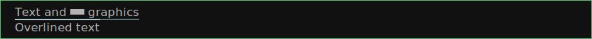

## NAME

`dzen2` - scriptable X11 status bars, notifications and menus

## SYNOPSIS

    dzen2 [OPTIONS] < input
    printf '%s\n' 'Hello' | dzen2 -p
    status.sh | dzen2 -w 800 -ta l
    printf '%s\n' 'Menu' 'xterm' 'xclock' | dzen2 -l 2 -m v -p

Use `dzen2-help` to read this document with live formatting. Right-click or
press Escape to close that viewer.

## DESCRIPTION

Dzen displays a stream of newline-terminated text from standard input.
Your script supplies data and determines when updates happen; dzen draws it
and handles mouse, keyboard and signal events. It runs on X11.

Use it for a status bar, a notification, a scrollable log or a menu.
Text can contain colors, fonts, icons, shapes and clickable regions.
Optional build features include XFT, XPM, Xinerama, XRandR and Xcursor.
The gadgets directory supplies dbar, gdbar, gcpubar and textwidth helpers.

## FORK DIFFERENCES

Comparison baseline: the upstream robm/dzen history at commit
488ab66019f475e35e067646621827c18a879ba1 (2013-09-23), before this fork's
local development. This is a historical comparison, not a claim about the
latest upstream version. Fork repository: https://github.com/osv/dzen

- Resource reuse: color/font caches reduce repeated X11 resource allocation.
- Input capacity: upstream's 8192-byte buffer is replaced by a streaming
  reader accepting up to 16 MiB per line. See LIMITATIONS.
- Layout: `^left()`, `^center()` and `^right()` provide independently aligned
  regions in one instance. They reset formatting for the following region.
- Runtime themes: `^normfg()`, `^normbg()` and `^normfn()` change normal defaults.
- Box model: `-b` / `^border()` and `-pad` / `^padding()` add borders and padding.
- Decorations: underline and overline spans cover text, icons and graphics.
- Monitors: XRandR output selection follows changes and disconnection.
- Interaction: optional Xcursor feedback over clickable areas.
- Compatibility: `-p N` persistence takes pointer presence into account.
  hide fully unmaps hidden surfaces; upstream left a one-pixel strip.
  A hidden surface needs a signal or active key grab to restore it.
- Lifecycle: SIGTERM runs onexit and returns 143.
- Development: GNU Autotools builds and unit/integration tests.

Traditional stdin formatting, title/slave windows and event bindings remain
the basis of the interface. Review INPUT PROTOCOL and EVENTS AND ACTIONS
when adapting scripts, especially custom `-e` bindings and whole-line commands.

## QUICK START

Keep a message visible after its producer exits:

    printf '%s\n' 'Hello world' | dzen2 -p

Without `-l`, every new line replaces the title:

    while :; do
        date '+%H:%M:%S'
        sleep 1
    done | dzen2 -w 240 -ta c

Show a title and two body lines immediately:

    printf '%s\n' 'Status' 'Service running' 'Connected' |
        dzen2 -l 2 -p -e 'onstart=uncollapse;button3=exit'

Specifying `-e` replaces ALL default event bindings. This example explicitly
opens the slave window and binds right-click to exit.

## INPUT PROTOCOL

The title is a single line. The optional slave is a scrollable body.
In the usual vertical layout it opens below the title; placement near the
bottom of the screen can put it above the title instead.

    +---------------------------+
    | Title: one line           |  first input line, or ^tw()TEXT
    +---------------------------+
    | Slave: body line 1        |  subsequent input lines
    | Slave: body line 2        |  -l N controls visible body lines
    | ...                       |  wheel scrolls through the buffer
    +---------------------------+

Without `-l`, only the title is used. A collapsed slave retains its contents
but is not visible. Horizontal menu mode (`-m` h) displays slave entries in a
single row and does not display title content.

    producer -> newline-terminated stdin -> title / slave
    mouse, keyboard, signals -> event bindings -> actions / stdout / processes

Without `-l`, each ordinary input line replaces the title. With `-l N`, the
first ordinary line supplies the title and subsequent lines enter the slave
buffer; N is the number of visible body lines, not the input buffer length.
By default the slave opens when the pointer enters the title.

There are three kinds of input:

- Rendered lines: text mixed with inline commands such as `^fg(red)`.
  Formatting starts from normal defaults for each line.
- Routed lines: `^tw()`TEXT explicitly updates the title. Put `^tw()` first,
  once per line. It does not append TEXT to the slave.
- Control lines: `^cs()`, `^padding(...)` and the other CONTROL COMMANDS.
  Each must occupy its own line. They are consumed, not displayed as text.

Write a newline after each message. Flush buffered output in your producer
when an update should become visible. Double a caret to display it literally.
Input examples show the characters to send to dzen; README.dzen doubles
their carets again so they can be read in the live viewer.

Inline color/font changes affect subsequent content in that line.
`^fg()`, `^bg()` and `^fn()` restore normal defaults; they do not mean
"restore the previous span". Alignment commands start a new region and
reset formatting. Runtime normal-default commands affect subsequent drawing;
resend content when you want a full repaint with a new theme.

EOF normally ends dzen. `-p` keeps it alive; `-p N` adds a timeout after EOF.
See EXIT STATUS for timeout and signal details.

## OPTIONS

Appearance:

    -fg COLOR             normal foreground
    -bg COLOR             normal background
    -fn FONT              normal font; xft: and x: select a backend
    -b SPEC               outer border widths and optional color
    -pad SPEC             padding widths
    -underline N[,COLOR]  default underline thickness and optional color
    -overline N[,COLOR]   default overline thickness and optional color
    -ta l|c|r             title alignment (left, center or right)
    -sa l|c|r             slave alignment

Geometry and window properties:

    -x PIXELS             content x position
    -y PIXELS             content y position
    -w PIXELS             slave width (also the title fallback width)
    -tw PIXELS            explicit title width
    -h PIXELS             line height
    -geometry WxH+X+Y     title geometry in X geometry syntax
    -expand left|center|right  grow/shrink title to its content
    -dock                 set dock type and reserve space through EWMH struts
    -title-name NAME      title/outer name (default: dzen title)
    -slave-name NAME      slave name (default: dzen slave)

Input and interaction:

    -l N                  visible slave lines; see MULTI-LINE WINDOWS
    -m [v|h]              vertical (default) or horizontal menu; requires -l
    -e BINDINGS           events and actions; replaces all default bindings
    -p [SECONDS]          persist after EOF, optionally with a timeout
    -u                    deprecated fixed-size updates; see LIMITATIONS

Monitors and information:

    -xs N                 Xinerama screen number; requires Xinerama support
    -output NAME          follow an XRandR output; requires XRandR support
    -lm                   list connected XRandR outputs with an active CRTC
    -v                    version and enabled features (requires X display)

Defaults: foreground grey70, background #111111, fixed font, title centered,
slave left-aligned, no border or padding, no slave window, no EOF persistence.
Line height defaults to font height + 2. Without explicit widths, available
target geometry is used. See MONITOR SELECTION for target selection.
Options affecting the same value are processed in command-line order.

`-b SPEC` adds an outer border.  SPEC accepts one, two, or four non-negative
widths and an optional X11 color:

    -b 10
    -b 10,8
    -b 10,8,10,8,red

One width applies to every side; two mean vertical,horizontal; four mean
top,right,bottom,left.  Without a color, the border follows `-bg` and later
`^normbg(...)` changes.  Borders do not change explicit content sizes or
clickable-area coordinates.  `-b 0` disables the border.

`^border(SPEC)` uses the same grammar and replaces the border at runtime.  It
must occupy its own input line.  Invalid runtime specifications are silently
ignored.

`-pad SPEC` adds padding around the union of the visible title and slave
content. SPEC accepts one, two, or four non-negative widths:

    -pad 10
    -pad 10,8
    -pad 10,8,10,8

One width applies to every side; two mean vertical,horizontal; four mean
top,right,bottom,left. Padding always uses the normal `-bg` color, including
later `^normbg(...)` changes. `^padding(SPEC)` replaces all four sides at
runtime, and `^padding(0)` disables it. The command must occupy its own input
line; invalid runtime specifications are silently ignored.

The visible box model is `border -> padding -> content`. Explicit `-x`, `-y`,
`-w`, `-tw`, and `-h` values continue to describe content; padding and border
grow outward and are included in dock struts. A single padding box surrounds
the visible title/slave union, so it does not add a gap between them. Padding
does not change text or clickable-area coordinates.

`-underline THICKNESS[,COLOR]` and `-overline THICKNESS[,COLOR]` configure
default span-decoration styles. They do not enable decorations by themselves.
The built-in default for each is one pixel using the normal foreground color.
An omitted color follows `-fg` and later `^normfg(...)` changes; an explicit
color is independent. Specifications are strict and contain no whitespace:
`2,orange` is valid, while `2, orange` is not.

Use `^underline(...)` and `^overline(...)` in input to enable a decoration.
An empty argument uses the configured defaults, a single argument may override
the thickness or color, and two arguments override both. `off` closes the
active span:

    ^overline()text and ^r(20x8) graphics^overline(off)
    ^underline(2,lightblue)underlined^underline(off)

Decorated spans include text, spaces, icons, rectangles, circles, block
alignment, and horizontal `^p(...)`/`^pa(...)` movement. They use constant
memory and normal painter order, so later explicitly positioned content may
overwrite a previously closed decoration. Decorations are clipped inside the
line and do not affect geometry or clickable areas.


## MONITOR SELECTION

Without a monitor selector, dzen uses the root-window geometry and follows
XRandR changes to its size.

`-output NAME` selects a physical XRandR output by name.  Dzen follows changes
to that output's mode, position and rotation.  If the output is disconnected,
its windows and dock struts are hidden; reconnecting it restores the windows
with the original `-x`, `-y`, `-tw` and `-w` settings.  An unknown output name
is an error.  Use `-lm` to list connected outputs which currently have an
active CRTC.

`-output` and `-xs` are mutually exclusive.  The legacy `-xs` selector is
static: values from 1 through the number of Xinerama screens select that
screen, while 0, negative and out-of-range values use the root geometry.
Geometry is resolved once at startup and later XRandR events are ignored when
`-xs` was explicitly supplied.


## MULTI-LINE WINDOWS

Enables support for displaying multiple lines. The parameter to "`-l`"
specifies the number of lines to be displayed.

These lines of input are held in the slave window which becomes active as soon
as the pointer enters the title (default action) window.

If the mouse leaves the slave window it will be hidden unless it is set
sticky by clicking with Button2 into it (default action).

Button4 and Button5 (mouse wheel) will scroll the slave window up
and down if the content exceeds the window height (default action).


## MENUS

Dzen provides two menu modes, vertical and horizontal menus. You can
access these modes by adding 'v'(vertical) or 'h'(horizontal) to the
'`-m`' option. If nothing is specified dzen defaults to vertical menus.

Vertical menu, both invocations are equivalent:

    dzen2 -p -l 4 -m < file
    dzen2 -p -l 4 -m v < file

Horizontal menu:

    dzen2 -p -l 4 -m h < file


All actions beginning with "menu" work on the selected menu entry.

Note:   Menu mode only makes sense if `-l <n>` is specified!
        Horizontal menus do not display title content.  Title-only
        actions are otherwise ignored, but `hide`, `unhide`, and
        `togglehide` control the complete horizontal surface.


## X RESOURCES

Startup precedence: built-in defaults < X resources < command-line options.
As an example you can add following lines to ~/.Xresources

    dzen2.font:       -*-fixed-*-*-*-*-*-*-*-*-*-*-*-*
    dzen2.foreground: green
    dzen2.background: black
    dzen2.underline:  2,orange
    dzen2.overline:   1,lightblue
    dzen2.titlename:  dzen title
    dzen2.slavename:  dzen slave

Decoration resources use the same `THICKNESS[,COLOR]` grammar as their command
line options. Command-line values override X resources.


## FORMATTING COMMANDS

These commands may be mixed with text. They change rendering, not global
window geometry. Colors accept X11 names or #rrggbb values.

### Colors:

    ^fg(color)         Set foreground color
    ^fg()              Without arguments, sets default fg color
    ^bg(color)         Set background color
    ^bg()              Without arguments, sets default bg color

    ^fn(FONT)          Select font for subsequent content in this line
    ^fn()              Restore the normal font
                       Prefix xft: or x: to select the font backend.
                       XFT fonts require an XFT-enabled build.

### Graphics:

    ^i(path)           Draw icon specified by path
                       supported formats: XBM and optionally XPM

    ^r(WIDTHxHEIGHT)   Draw a rectangle with the dimensions
                       WIDTH and HEIGHT
    ^ro(WIDTHxHEIGHT)  Rectangle outline

    ^c(DIAMETER)         Draw a circle with diameter DIAMETER pixels
    ^co(DIAMETER)        Circle outline

    ^underline()       Enable underline with configured defaults
    ^underline(ARG)    Enable underline with a thickness, color, or both
    ^underline(off)    Disable underline
    ^overline()        Enable overline with configured defaults
    ^overline(ARG)     Enable overline with a thickness, color, or both
    ^overline(off)     Disable overline

### Positioning:

    ^p(ARGUMENT)       Position next input amount of PIXELs to the right
                       or left of the current position
                       a.k.a. relative positioning

    ^pa(ARGUMENT)      Position next input at PIXEL
                       a.k.a. absolute positioning
                       For maximum predictability ^pa() should only be
                       used with -ta l or -sa l

     Where ARGUMENT:

     ^p(+-X)           Move X pixels to the right or left of the current position (on the X axis)

     ^p(+-X;+-Y)       Move X pixels to the right or left and Y pixels up or down of the current
                       position (on the X and Y axis)

     ^p(;+-Y)          Move Y pixels up or down of the current position (on the Y axis)

     ^p()              Without parameters resets the Y position to its default

     ^pa()             Takes the same parameters as described above but positions at
                       the absolute X and Y coordinates

     Further ^p() also takes some symbolic names as argument:

     _LOCK_X           Lock the current X position, useful if you want to
                       align things vertically
     _UNLOCK_X         Unlock the X position
     _LEFT             Move current x-position to the left edge
     _RIGHT            Move current x-position to the right edge
     _TOP              Move current y-position to the top edge
     _CENTER           Move current x-position to center of the window
     _BOTTOM           Move current y-position to the bottom edge

    ^ba(WIDTH,ALIGN)   Align the next text run in WIDTH pixels
                       ALIGN is _LEFT, _CENTER or _RIGHT
    ^ba()              Cancel pending block alignment
                       Block alignment resets after drawing that text run.

    ^left()            Align next input to left. Reset settings (fg, bg, fn, etc)
    ^center()          Align next input to center. Reset settings (fg, bg, fn, etc)
    ^right()           Align next input to right. Reset settings (fg, bg, fn, etc)
                       Example:
                         ^left()^fg(red)Left ^center()^fg(green)Center ^right()^fg(blue)Right

### Interaction:

    ^ca(BTN, CMD) ... ^ca()

                       Used to define 'clickable areas' anywhere inside the
                       title window or slave window.
                       - 'BTN' denotes the mouse button (1=left, 2=middle, 3=right, etc.)
                       - 'CMD' denotes the command that should be spawned when the specific
                         area has been clicked with the defined button
                       - '...' denotes any text or formatting commands dzen accepts
                       - '^ca()' without arguments denotes the end of this clickable area

                       Example: ^ca(1,echo clicked)Click me^ca()

    ^ib(1)             Do not paint backgrounds over earlier content
    ^ib(0)             Resume background painting (the default)

Use `^ib(1)` with positioning commands to overlay shapes. XBM icons use
foreground/background colors; XPM requires an XPM-enabled build.
Paths are relative to the process working directory.
Run direct README.dzen demonstrations from the project directory so the
example bitmaps can be found. The installed `dzen2-help` sets its working
directory to the documentation directory for these assets.

### A compact status bar

```text
^left()^underline(gold) 1 ^underline(off) 2  3^center()Editor^right()^fg(limegreen)online^fg() 12:34
```


Each alignment command starts a new region and resets its formatting.
The workspace number and time are static sample data; your script supplies
the current values.

### Status with foreground and background colors

```text
Status: ^fg(limegreen)online^fg() | Errors: ^bg(maroon)^fg(white) 3 ^fg()^bg() | normal
```


The error count has white text on a maroon background. Empty `^fg()` and
`^bg()` restore normal colors for subsequent text.

### Spacing between fields

```text
CPU^p(12)24%^p(24)RAM^p(12)42%
```


`^p(N)` moves the next element N pixels to the right of the current position.

### A clickable launcher

```text
^ca(1,xterm)^fg(lightblue)[ Terminal ]^fg()^ca()  ordinary text
```


Left-click the bracketed label to launch xterm (which must be installed).
`^ca()` closes the clickable area; the following text is outside it.

### Fixed-width text columns

```text
^ba(90,_LEFT)CPU^ba(50,_RIGHT)9%
^ba(90,_LEFT)Memory^ba(50,_RIGHT)42%
```


Each label occupies 90 pixels and each value occupies 50 pixels, aligned
right. Block alignment applies to the next text run, so repeat it per field.

### A progress bar with a value

```text
CPU ^fg(gray30)^r(100x8)^p(-100)^fg(limegreen)^r(35x8)^p(65)^fg() 35%
```


Draw a 100-pixel track, move back 100 pixels and draw a 35-pixel fill.
Move forward the remaining 65 pixels before writing the value. Your script
calculates the fill width; dzen does not calculate percentages.

### Left, center and right regions

```text
^left()^fg(red)Left^center()^fg(seagreen)Center^right()^fg(lightblue)Right
```


### Underline and overline spans

```text
^underline(1,lightblue)Text and ^r(20x8) graphics^underline(off)
^overline()Overlined text^overline(off)
```




### Positioned graphics

```text
^ib(1)^fg(red)^ro(100x15)^p(-98)^fg(blue)^r(20x10)^fg(orange)^p(3)^r(40x10)^p(4)^fg(darkgreen)^co(12)^p(2)^c(10)
```


### XBM icons

```text
^i(bitmaps/envelope.xbm) Mail ^fg(seagreen)^i(bitmaps/battery.xbm) Battery
```


### Literal carets

```text
Two literal carets: ^^^^
```


## CONTROL COMMANDS

Send each command as the first and only content of its input line.
Do not concatenate control commands or append display text to them.

    ^togglecollapse()
    ^collapse()
    ^uncollapse()
    ^togglestick()
    ^stick()            See EVENTS AND ACTIONS for a detailed description
    ^unstick()          of each command.
    ^togglehide()
    ^hide()
    ^unhide()
    ^raise()
    ^lower()
    ^scrollhome()
    ^scrollend()
    ^exit()

    ^cs()              Clear the slave buffer
    ^normfg(COLOR)     Change the normal foreground, restored by ^fg()
    ^normbg(COLOR)     Change the normal background, restored by ^bg()
    ^normfn(FONT)      Change the normal font, restored by ^fn()
    ^border(SPEC)      Replace the outer border; same syntax as -b
    ^padding(SPEC)     Replace padding; same syntax as -pad

Invalid border/padding specifications are ignored. These commands replace
the complete specification, not selected sides. Other command arguments
follow their own parsers; there is no universal whitespace-trimming rule.

Routing command (unlike the above, it carries display text):

    ^tw()TEXT          Draw TEXT to title; put the command first, once per line

## EVENTS AND ACTIONS

Dzen allows the user to associate actions to events.

The command line syntax is as follows:

    -e 'event1=action1:option1:...option<n>,...,action<m>;...;event<l>'


Every event can take any number of actions and every action can take any number
of options. (By default limited to 64 each, easily changeable in action.h)

An example:

    -e 'button1=exec:xterm:firefox;entertitle=uncollapse,unhide;button3=exit'

Meaning:

- `button1=exec:xterm:firefox;`
On Button1 event (Button1 release on the mouse) execute xterm and
firefox.

Note: xterm and firefox are options to the exec action

- `entertitle=uncollapse,unhide;`
On entertitle (mouse pointer enters the title window) uncollapse
slave window and unhide the title window

- `button3=exit`
On button3 event exit dzen


### Supported events:

    onstart             Perform actions right after startup
    onexit              Perform actions just before exiting
    onnewinput          Perform actions if there is new input for the slave window
    button1             Mouse button1 released
    button2             Mouse button2 released
    button3             Mouse button3 released
    button4             Mouse button4 released (usually scrollwheel)
    button5             Mouse button5 released (usually scrollwheel)
    button6             Mouse button6 released
    button7             Mouse button7 released
    entertitle          Mouse enters the title window
    leavetitle          Mouse leaves the title window
    enterslave          Mouse enters the slave window
    leaveslave          Mouse leaves the slave window
    sigusr1             SIGUSR1 received
    sigusr2             SIGUSR2 received
    key_KEYNAME         Keyboard events (*)

    (*) Keyboard events:
    --------------------

    Every key can be bound to an action (see below). The format is:
    `key_KEYNAME` where KEYNAME is the name of the key as defined in
    keysymdef.h (usually: /usr/include/X11/keysymdef.h).  The part
    after `XK_` in keysymdef.h must be used for KEYNAME.


### Supported actions:

    exec:command1:..:n  execute all given options
    menuexec            executes selected menu entry
    exit:retval         exit dzen and return 'retval'
    print:str1:...:n    write all given options to STDOUT
    menuprint           write selected menu entry to STDOUT
    collapse            collapse (roll-up) slave window
    uncollapse          uncollapse (roll-down) slave window
    togglecollapse      toggle collapsed state
    stick               stick slave window
    unstick             unstick slave window
    togglestick         toggle sticky state
    hide                strictly hide the title surface
    unhide              restore the hidden surface
    togglehide          toggle strict hide state
    raise               raise window to view (above all others)
    lower               lower window (behind all others)
    scrollhome          show head of input
    scrollend           show tail of input
    scrollup:n          scroll slave window n lines up   (default n=1)
    scrolldown:n        scroll slave window n lines down (default n=1)
    grabkeys            enable keyboard support
    ungrabkeys          disable keyboard support
    grabmouse           enable mouse support
                        only needed with specific windowmanagers, such as fluxbox
    ungrabmouse         release mouse
                        only needed with specific windowmanagers, such as fluxbox

`hide` fully unmaps title-only, collapsed vertical, and horizontal surfaces.
An expanded vertical menu keeps its slave visible.  `unhide` restores the
previous collapsed or expanded state.  A fully unmapped surface cannot receive
pointer events; restore it with a signal or an active key grab.


    Note:   If no events/actions are specified dzen defaults to:

        Title only mode:
        ----------------

        -e 'button3=exit:13'


        Multiple lines and vertical menu mode:
        --------------------------------------

        -e 'entertitle=uncollapse,grabkeys;
            enterslave=grabkeys;leaveslave=collapse,ungrabkeys;
            button1=menuexec;button2=togglestick;button3=exit:13;
            button4=scrollup;button5=scrolldown;
            key_Escape=ungrabkeys,exit'


        Horizontal menu mode:
        ---------------------

        -e 'enterslave=grabkeys;leaveslave=ungrabkeys;
            button4=scrollup;button5=scrolldown;
            key_Left=scrollup;key_Right=scrolldown;
            button1=menuexec;button3=exit:13;
            key_Escape=ungrabkeys,exit'


        If you define any events/actions, there is no default behaviour,
        i.e. you will have to specify _all_ events/actions you want to
        use.


## EXAMPLES

Update a title without appending to the slave:

    {
        printf '%s\n' 'Status' 'Service running' 'Connected'
        sleep 2
        printf '%s\n' '^tw()Status: updated'
    } | dzen2 -l 2 -p -e 'onstart=uncollapse;button3=exit'

Replace the slave contents and update the title:

    {
        printf '%s\n' 'Tasks' 'Build: waiting' 'Tests: waiting'
        sleep 2
        printf '%s\n' '^cs()' 'Build: done' 'Tests: passed'
        printf '%s\n' '^tw()Tasks: complete'
    } | dzen2 -l 2 -p -e 'onstart=uncollapse;button3=exit'

`^cs()` clears the old slave buffer without replacing the title. The next
two lines refill the slave; `^tw()` explicitly replaces the title. Each
control command is sent on its own line, not mixed into a rendered line.

Change window styling at runtime; commands occupy separate lines:

    {
        printf '%s\n' 'Initial theme'
        sleep 2
        printf '%s\n' '^normbg(darkgreen)' '^padding(4,8)'
        printf '%s\n' 'Updated theme (bg changed, padding added)'
    } | dzen2 -p -b '1,seagreen'

Return the selected menu entry to stdout:

    printf '%s\n' 'Choose' 'First' 'Second' |
        dzen2 -l 2 -m v -p \
          -e 'onstart=uncollapse;button1=menuprint,exit;button3=exit'

Launch an application from a horizontal menu:

    printf '%s\n' 'Applications' 'xterm' 'xclock' |
        dzen2 -l 2 -m h -p

The first line is still supplied, although horizontal menus do not show
title content. The default button1 binding executes the selected entry.

Show a growing log:

    { printf '%s\n' 'Log'; tail -f application.log; } |
        dzen2 -l 12 -w 600 -p

Provide your own application.log. Hover over the title to expand the log;
use the wheel to scroll. Menu execution and clickable commands execute shell
commands, so only use trusted command strings.

## EXIT STATUS

`dzen` uses two different approaches to terminate itself:

* Timed termination: if EOF is received -> terminate
  - unless the `-p` option is set
    - -p Without argument persist forever
    - -p With argument n persist for n seconds,
           only when the mouse is not over the window.

* Interactive termination: if mouse button3 is clicked -> terminate
  - this is the default behaviour, see EVENTS AND ACTIONS
  - in some modes the Escape key terminates too, see EVENTS AND ACTIONS

`SIGTERM` performs the normal shutdown lifecycle, including the `onexit` event,
and exits with status 143. An `exit:N` action attached to `onexit` does not
override that status. A `-p N` timeout also performs `onexit`, but exits with
status 0.


Return values:

    0       Normal EOF or persistence timeout
    1       An error; inspect stderr
    143     SIGTERM, after onexit
    N       An explicit exit:N action (default right-click uses 13)

## LIMITATIONS

Input lines are limited to 16 MiB; excess bytes are discarded until the next
newline. An unterminated final fragment is not a complete input message.
Individual command arguments and clickable areas have separate limits.
This is an X11 application; it needs an X server, including for `-v`.

Use printf instead of shell-dependent echo `-e` or print in portable examples.
Menu execution uses the entry as a command; menuprint writes it to stdout.

Troubleshooting:

- Window closes immediately: stdin reached EOF; use `-p`.
- Slave is invisible: `-l` enables it but default bindings wait for a hover.
  With custom `-e`, include onstart=uncollapse or an appropriate pointer event.
- Right-click stopped closing: your `-e` replaced the defaults; add button3=exit.
- Hidden window cannot be hovered: restore through sigusr1=unhide and SIGUSR1,
  or a previously active keyboard grab.
- Misplaced absolute content: use `-ta` l / `-sa` l with `^pa()`.
- Feature option is unavailable: check configure features and `dzen2` `-v`.
- `-fn-preload` is currently shadowed by `-fn` in option parsing; do not rely on it.

Deprecated `-u` (simultaneous fixed-size batches):

This option provides facilities to update the title and slave window at
the same time.

The way it works is best described by an example:

    Motivation:

    We want to display an updating clock in the title and some log
    output in the slave window.

    Solution:

    while true; do
          date                # output goes to the title window
          dmesg | tail -n 10  # output goes to the slave window
          sleep 1
    done | dzen2 -l 10 -u

For this to work correctly it is essential to provide exactly the number
of lines to the slave window as defined by the parameter to `-l`.


Prefer explicit `^tw()` updates in new scripts.

## INSTALLATION

Build dependencies: a C toolchain, GNU Autotools and Xlib headers.
Optional features require their corresponding development libraries.

    autoreconf -vfi
    ./configure --enable-gadgets --enable-xft --enable-xpm \
        --enable-xinerama --enable-xrandr --enable-xcursor
    make
    make install

Use --disable-FEATURE to omit an optional feature. See each gadget's README
for its interface.

## DEVELOPMENT

### Build and change code

Configure the features you need as described in INSTALLATION, then use:

    make          # build dzen2 and update documentation and changed screenshots
    make check    # run tests, including documentation checks

After changing configure.ac or Makefile.am, rerun autoreconf -vfi and configure.
Run make format after editing C sources or headers; it requires clang-format.

Source layout:

- src/main.c handles startup, options and the event loop.
- src/draw.c parses inline rendering and whole-line control commands.
- src/action.c implements event actions; src/action.h declares them.
- src/font.c handles fonts; src/caches.c manages rendering caches.
- gadgets/ contains the auxiliary programs.
- build-aux/ contains documentation and build helpers.

Keep inline drawing commands separate from whole-line control commands.
For new settings, preserve the order: built-in defaults, X resources, then
command-line overrides. Add user-visible changes to the documentation and
include new source/test files in the appropriate Makefile.am.

### Testing changes

make check runs the tests applicable to the configured build. Unit tests live
in tests/unit/; integration tests under tests/integration/ cover signals,
rendering and monitor changes. Use CHECK from test_common.h in C tests so
checks also run when assertions are disabled.

For a focused rendering check, run the visual runner with a case file and
optionally the line number of an individual case:

    tests/integration/visual/runner.sh tests/integration/visual/xft/cases.md
    tests/integration/visual/runner.sh tests/integration/visual/xft/cases.md:286

The runner uses an isolated Xvfb display. Review actual images and diffs before
explicitly updating expected images for an intentional rendering change.
Keep temporary actual/diff files out of commits. Set NO_COLOR=1 for plain
test output. Use make distcheck when changing build or installation rules;
it also checks building, installing and cleaning a distribution archive.

### Editing documentation

Edit README.dzen and run the same make command used for code changes.
README.md and dzen2.1 are generated files. New or changed examples and missing
PNGs are rendered automatically into docs/screenshots/; prose-only changes
do not take screenshots. Commit generated documentation, PNGs, text caches
and manifest together with README.dzen. Delete a PNG to regenerate it after
changing fonts or rendering code without changing the example text.

Source format:

- Use `^foo(bar)` for displayed dzen commands and ^foo(bar) for live commands.
- Use `-foo bar` for CLI references and code spans for event/action names.
- Use ordinary headings; dzen2-help styles headings and references automatically.
- Example blocks have a unique lowercase identifier (words/digits separated by
  hyphens), followed by Input and Result blocks with four-space indentation
  and a blank line after each block. Input doubles every caret and must decode
  exactly to Result. Result contains static rendering commands only.

Do not add manual styling to descriptions or Input blocks. Code blocks lose
backticks around command references but preserve shell substitutions. Direct
display of README.dzen remains possible without automatic reference styling.

Text generation requires Bash, POSIX awk and Pandoc. New screenshots also need
Xvfb, xset, xdotool, xwd and ImageMagick. Captures use the help viewer styling
and the default font on a fresh X server; font availability affects appearance.

See build-aux/generate-docs.awk for the generation pipeline and focused targets.

## AUTHORS AND SEE ALSO

Robert Manea (original dzen); Olexandr Sydorchuk (this fork).

- Project: https://github.com/osv/dzen
- Upstream: https://github.com/robm/dzen
- Related tools: `dzen2-help`, dbar, gdbar, gcpubar, textwidth.
