## Test: 1 Color

### Args: -fn "DejaVu Sans Mono:size=16:dpi=96:spacing=100:style=Book:antialias=true:hinting=false:rgba=none" -h 30 -w 300 -bg '#000' -fg '#fff'

### Pipe data

```
hello
wor^fg(#f00)l^fg(#0f0)d
```


## Test: 2 Rects

### Args: -fn  "DejaVu Sans Mono:size=16:dpi=96:spacing=100:style=Book:antialias=true:hinting=false:rgba=none" -h 30 -w 300 -bg '#000' -fg '#fff'

### Pipe data

```
^ib(1)^fg(red)^ro(100x15)^p(-98)^fg(blue)^r(20x10)^fg(orange)^p(3)^r(40x10)^p(4)^fg(darkgreen)^co(12)^p(2)^c(10)
```


## Test: 3 Menu horizontal

### Args: -l 4 -m h -fn  "DejaVu Sans Mono:size=16:dpi=96:spacing=100:style=Book:antialias=true:hinting=false:rgba=none" -h 30 -w 300 -bg '#000' -fg '#fff'

### Mouse: 70,10

Mouse over second the item

### Pipe data

Items for menu, first line is invisible header

```
header
line 1
line 2
line 3
line 4
```

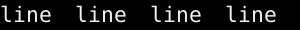


## Test: 4 Menu vertical

### Args: -l 4 -m -fn  "DejaVu Sans Mono:size=16:dpi=96:spacing=100:style=Book:antialias=true:hinting=false:rgba=none" -h 30 -w 300 -bg '#000' -fg '#fff'

### Pipe data

Add some items to menu

```
header
printf "line 1"
printf "line 2"
printf "line 3"
printf "line 4"
```

Should be visible only header


### Crop: 300x150+0+0

### Mouse: 10,10

Mouse over the header to uncollapse menu

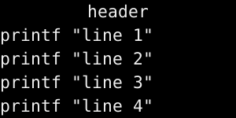

### Mouse: 10,61

Mouse over the second item (30 * 2 = 60)

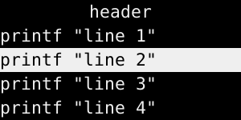

### Click and check output: 1, line 2

Left mouse button click (1) and check executed command, expected "line 2" 

### Mouse: 10,91

Move over the 3rd item

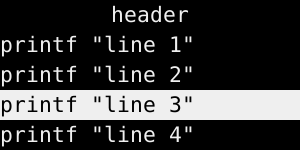

### Pipe data

Add more lines

```
^tw()Changed Header
printf "line 5"
printf "line 6"
```

Expected scrolled up:


### Press key: Up

Scroll up one row:

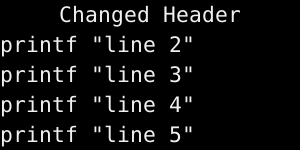

### Pipe data

Clear slave windown and add one line to slave window

```
^cs()
printf "line 7"
```

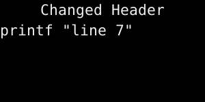

## Test: 5 Position

### Args: -l 5 -e onstart=uncollapse -fn "DejaVu Sans Mono:size=10:dpi=96:spacing=100:style=Book:antialias=true:hinting=false:rgba=none" -h 30 -w 300 -bg '#000' -fg '#fff'

### Pipe data

Not bug but feature:
- Padding after `_TOP` 2px
- `_BOTTOM`: 3px

```
DEF^r(1x16)^r(10x1)^r(1x16)^fg(red)^p(_TOP)^r(1x16)^r(10x1)^r(1x16)Top^r(1x16)^fg(green)^p(_BOTTOM)^p(0;-16)^r(1x16)^r(10x1)^r(1x16)_BOTTOM -16^r(1x16)^fg(#ff0)^p()^r(1x16)^r(10x1)^r(1x16)Reset
TOP: 2px ^r(1x16)^p(_TOP)^fg(red)^r(1x16)
Top 4 vlines^fg(red)^p(_TOP)^r(1x16)^p(_TOP)^r(1x16)^p(_TOP)^r(1x16)^p(_TOP)^r(1x16)
Bottom -16px: 3px: ^r(1x16)^p(_BOTTOM)^p(0;-16)^fg(green)^r(1x16)
Bottom 4 vlines ^fg(green)^p(_BOTTOM)^r(1x16+0-16)^p(_BOTTOM)^r(1x16+0-16)^p(_BOTTOM)^r(1x16+0-16)^p(_BOTTOM)^r(1x16+0-16)
_LOCK_X:^ib(1)^p(_LOCK_X)^ro(40x28)^ro(36x24+2)^ro(32x20+2)^p(_UNLOCK_X)
```

### Crop: 300x180+0+0

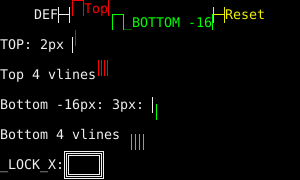

## Test: 6 Left align

### Args: -ta l -fn "DejaVu Sans Mono:size=16:dpi=96:spacing=100:style=Book:antialias=true:hinting=false:rgba=none" -h 30 -w 300 -bg '#000' -fg '#fff'

Used `-ta l`

### Pipe data

Absolute 150px

```
Text^pa(150)Abs150
```


### Pipe data

With `^p(_LEFT)` 

```
SomeText^p(_LEFT)^fg(green)left
```

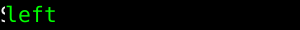

### Pipe data

With `^p(_CENTER)`

```
SomeText^p(_CENTER)^fg(green)CENTER
```


### Pipe data

With `^p(_RIGHT)`

```
SomeText^p(_RIGHT)^fg(green)RIGHT
```


## Test: 7 Center align

### Args: -ta c -fn "DejaVu Sans Mono:size=16:dpi=96:spacing=100:style=Book:antialias=true:hinting=false:rgba=none" -h 30 -w 300 -bg '#000' -fg '#fff'

Used `-ta c`

### Pipe data

Absolute 150px

```
Text^pa(150)Abs150
```


### Pipe data

With `^p(_LEFT)` 

```
SomeText^p(_LEFT)^fg(green)left
```


### Pipe data

With `^p(_CENTER)`

```
SomeText^p(_CENTER)^fg(green)CENTER
```


### Pipe data

With `^p(_RIGHT)`

```
SomeText^p(_RIGHT)^fg(green)RIGHT
```


## Test: 8 Right align

### Args: -ta r -fn "DejaVu Sans Mono:size=16:dpi=96:spacing=100:style=Book:antialias=true:hinting=false:rgba=none" -h 30 -w 300 -bg '#000' -fg '#fff'

Used `-ta r`

### Pipe data

Absolute 150px

```
Text^pa(150)Abs150
```

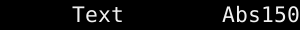

### Pipe data

With `^p(_LEFT)` 

```
SomeText^p(_LEFT)^fg(green)left
```

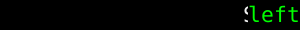

### Pipe data

With `^p(_CENTER)`

```
SomeText^p(_CENTER)^fg(green)CENTER
```


### Pipe data

With `^p(_RIGHT)`

```
SomeText^p(_RIGHT)^fg(green)RIGHT
```


## Test: 9 Block area

### Args: -l 5 -e onstart=uncollapse -fn "DejaVu Sans Mono:size=16:dpi=96:spacing=100:style=Book:antialias=true:hinting=false:rgba=none" -h 30 -w 300 -bg '#000' -fg '#fff'


### Pipe data

Block area `^ba` support only plain text align, broken ba means there is some other command.

```

Lef      :^ib(1)^ro(50x28)^p(-50)^ba(50,_LEFT)L
Center   :^ib(1)^ro(50x28)^p(-50)^ba(50,_CENTER)C
Right    :^ib(1)^ro(50x28)^p(-50)^ba(50,_RIGHT)R
Broken ba:^ib(1)^ro(50x28)^p(-50)^ba(50,_CENTER)^fg(green)C^ba()
Broken ba:^ib(1)^ro(50x28)^p(-50)^ba(50,_RIGHT)^fg(green)R^ba()
```

### Crop: 300x180+0+0

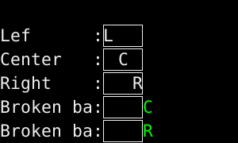

## Test: 10 Click Area

### Args: -ta l -fn "DejaVu Sans Mono:size=16:dpi=96:spacing=100:style=Book:antialias=true:hinting=false:rgba=none" -h 30 -w 300 -bg '#000' -fg '#fff'


### Pipe data

2 Sensetive Areas.

Area1:
      
      x1=0, x2=99
      y1= 7, y2=23

Because font is Y centered, `(30 - 16) / 2 = 7px` offset from top&bottom.

Area2:
 
      x1=100, x2=199

```
^ca(1, printf "area1")^bg(#050)^ba(100,_CENTER)area1^ca()^ca(1, printf "area2")^bg(#550)^ba(100,_CENTER)area2^ca()
```

### Mouse: 99,6

### Click and check output: 1,

No area, 1px Y before font start

### Mouse: 99,7

### Click and check output: 1, area1 

Area1

### Mouse: 99,23

### Click and check output: 1, area1 

Area1

### Mouse: 99,24

### Click and check output: 1, 

No Area, +1px after font height

### Mouse: 100,23

### Click and check output: 1, area2 

Area2

### Mouse: 199,23

### Click and check output: 1, area2 

Area2, last bottom pixel of area

### Mouse: 200,23

### Click and check output: 1, 

No area, +1px X after area2

## Test: 11 Icons

### Args: -fn "DejaVu Sans Mono:size=10:dpi=96:spacing=100:style=Book:antialias=true:hinting=false:rgba=none" -h 30 -w 300 -bg '#000' -fg '#fff'

### Pipe data


```
^fg(green)^i(bitmaps/envelope.xbm)^i(./bitmaps/battery_on.xpm)
```


### Pipe data

Multiple background of icons

```
^fg(black)^bg(red)b/r^i(bitmaps/envelope.xbm)^i(bitmaps/battery_on.xpm)  ^fg(red)^bg(blue)r/b^i(bitmaps/envelope.xbm)^i(bitmaps/battery_on.xpm) ^fg(black)^bg(pink)b/p^i(bitmaps/envelope.xbm)^i(bitmaps/battery_on.xpm)
```


## Test: 12 Action: 'menuprint'

### Args: -e 'button1=menuprint;onstart=uncollapse' -m -l 4 -ta l -fn "DejaVu Sans Mono:size=16:dpi=96:spacing=100:style=Book:antialias=true:hinting=false:rgba=none" -h 30 -w 300 -bg '#000' -fg '#fff'

### Mouse: 1, 61

Mouse over second the item (2 * 30 + 1)

### Pipe data

Items for menu, first line is invisible header

```
header
line 1
line 2
line 3
line 4
```

### Click and check output: 1, line 2

### Mouse: 10, 91

### Click and check output: 1, line 3

### Mouse: 10, 121

### Click and check output: 1, line 4

## Test: 13 expand left

### Args: -expand left -x 0 -fn "DejaVu Sans Mono:size=16:dpi=96:spacing=100:style=Book:antialias=true:hinting=false:rgba=none" -h 30 -bg '#000' -fg '#fff'

### Pipe data

Firstly, draw large text, then short text. 

Expected: the window size is enough to fit the last text.  

```
123456789
123^r(20x10)
```

It is possible to test window alignment in screen space when running in a GitHub
Action environment  (by using  screen crop), but  I want to  able run  this test
locally.

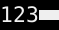

### Pipe data

Lock X with expand

```
^p(_LOCK_X)LOCK_X^p(_UNLOCK_X)1234
```

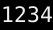

## Test: 14 expand right

### Args: -expand right -x 0 -fn "DejaVu Sans Mono:size=16:dpi=96:spacing=100:style=Book:antialias=true:hinting=false:rgba=none" -h 30 -bg '#000' -fg '#fff'

### Pipe data

```
123456789
123^r(20x10)
```


### Pipe data

Lock X with expand

```
^p(_LOCK_X)LOCK_X^p(_UNLOCK_X)1234
```


## Test: 15 Align commands

### Args: -l 5 -e onstart=uncollapse -fn "DejaVu Sans Mono:size=10:dpi=96:spacing=100:style=Book:antialias=true:hinting=false:rgba=none" -h 30 -w 400 -bg '#000' -fg '#fff'

### Pipe data

Use different aligns (`^left()` and so on). Should reset settings

```
^left()^fg(red)1 | 2 | 3 | ^center()^fg(blue)12:34 ^right()^fg(darkgreen) CPU ^fg(green)1% ^fg(darkgreen)Mem: ^fg(green)99%
^left()^fg(red)1 Left ^right()^fg(green)2 Right ^center()^fg(blue)3 Center
^left()^fg(red)Left only
^right()^fg(green)Right only
^center()^fg(blue)Center only
^right()^fg(green)^r(350x20)Right^left()Left^r(20x10)
```

### Crop: 400x180+0+0

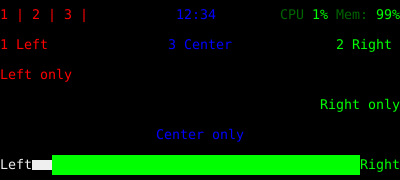


## Test: 16 normbg/normfg commands

### Args: -l 5 -e onstart=uncollapse -fn "DejaVu Sans Mono:size=16:dpi=96:spacing=100:style=Book:antialias=true:hinting=false:rgba=none" -h 30 -w 300 -bg pink

### Pipe data

`^normfg` and `^normbg` used for changing fg and bg. You should use `^tw()` and `^cs()` to clear all

```
^normfg(yellow)
^normbg(red)
^tw()Head
^cs()
Line 1
Line 2
```

### Crop: 300x180+0+0

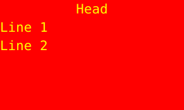

### Pipe data

`^normfn` is used for changing default font. You should use `^tw()` and `^cs()` to clear all

```
^normfn(DejaVu Sans Mono:size=8:dpi=96:spacing=100:style=Book:antialias=true:hinting=false:rgba=none)
^tw()Head
^cs()
Line 1
Line 2
```

### Crop: 300x180+0+0

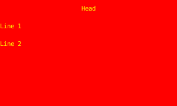

## Test: 17 Delayed persist `-p 2`

This test run in persist 2 second mode. App must exit after 1 second

### Args: -h 30 -w 300 -p 2

### Mouse: 400,10

Ensure the mouse is not over the window.

### Sleep: 1

Sleep for 1 second, and check if still running

### Dzen app is running?: yes

### Sleep: 2

### Dzen app is running?: no

## Test: 18 Tooltip behavior `-p 1`

This test runs in persist mode for 1 second. The app must exit after 1 second,
but only if the mouse is not over the window.

### Args: -h 30 -w 300 -p 1

Use `-p 1`, delay for 1 seconds

### Mouse: 10,10

Move mouse over window

### Sleep: 2

### Dzen app is running?: yes

The app must still be running.

### Mouse: 400,10

Move mouse somewhere

### Sleep: 2

### Dzen app is running?: no

