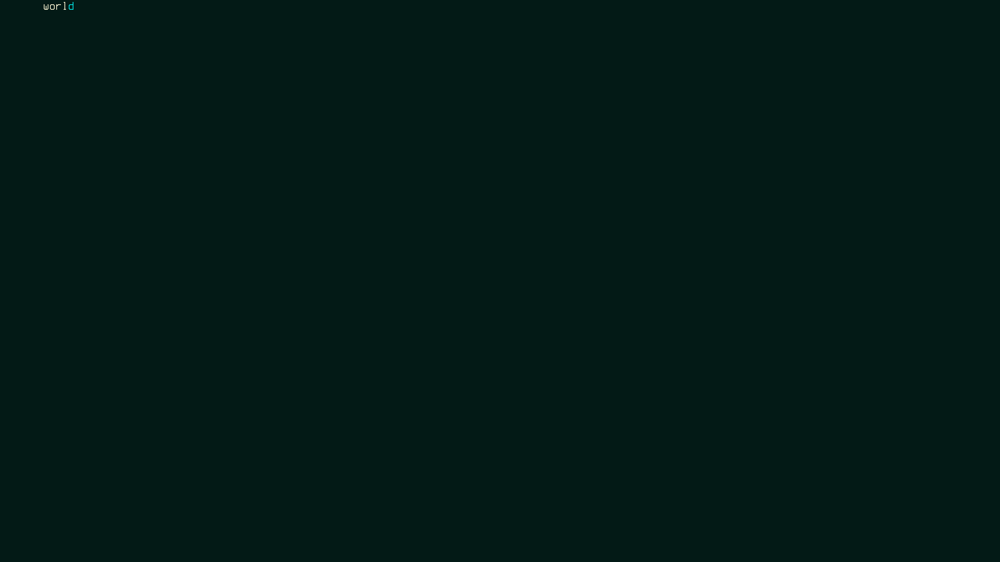
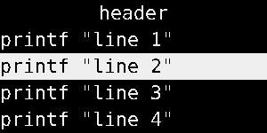

## Test: 1 simple

### Args: -fn "DejaVu Sans Mono:size=16:dpi=96:spacing=100:style=Book:antialias=false:hinting=false" -h 30 -w 300 -bg '#000' -fg '#fff'



### Pipe data


```
hello
worl^fg(#f00)d
```

## Test: 2 simple2

### Args: -fn  "DejaVu Sans Mono:size=16:dpi=96:spacing=100:style=Book:antialias=false:hinting=false" -h 30 -w 300 -bg '#000' -fg '#fff'


### Pipe data

```
^r(1x20)^p(1)^ro(3x16)^r(100x2)hello
```

## Test: 3 Menu horizontal

### Args: -l 4 -m h -fn  "DejaVu Sans Mono:size=16:dpi=96:spacing=100:style=Book:antialias=false:hinting=false" -h 30 -w 300 -bg '#000' -fg '#fff'

### Mouse: 10,10


### Pipe data

```
header
line 1
line 2
line 3
line 4
```

## Test: 4 Menu vertical - highlight menu and click

### Args: -l 4 -m -fn  "DejaVu Sans Mono:size=16:dpi=96:spacing=100:style=Book:antialias=false:hinting=false" -h 30 -w 300 -bg '#000' -fg '#fff'

### Mouse: 10,10
Move mouse to the header to uncollapse menu

### Mouse: 10,61
Move mouse below header to highlight second item (30 * 2 = 60)

### Crop: 300x150+0+0

### Pipe data

```
header
printf "line 1"
printf "line 2"
printf "line 3"
printf "line 4"
```

### Click and check output: 1, line 2

Left mouse button click (1) and check executed command, expected "line 2" 


