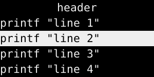
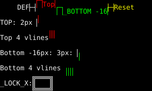

## Test: 1 Color

### Args: -fn "DejaVu Sans Mono:size=16:dpi=96:spacing=100:style=Book:antialias=true:hinting=false:rgba=none" -h 30 -w 300 -bg '#000' -fg '#fff'

### Pipe data

```
hello
wor^fg(#f00)l^fg(#0f0)d
```


## Test: 2 Rects

### Args: -fn  "DejaVu Sans Mono:size=16:dpi=96:spacing=100:style=Book:antialias=true:hinting=false:rgba=none" -h 30 -w 300 -bg '#000' -fg '#fff'

### Pipe data

```
^r(1x20)^p(1)^ro(3x16)^r(100x2)hello
```


## Test: 3 Menu horizontal

### Args: -l 4 -m h -fn  "DejaVu Sans Mono:size=16:dpi=96:spacing=100:style=Book:antialias=true:hinting=false:rgba=none" -h 30 -w 300 -bg '#000' -fg '#fff'

### Mouse: 70,10

Mouse over second the item

### Pipe data

Items for menu, first line is invisible header

```
header
line 1
line 2
line 3
line 4
```


## Test: 4 Menu vertical

### Args: -l 4 -m -fn  "DejaVu Sans Mono:size=16:dpi=96:spacing=100:style=Book:antialias=true:hinting=false:rgba=none" -h 30 -w 300 -bg '#000' -fg '#fff'

### Pipe data

Add some items to menu

```
header
printf "line 1"
printf "line 2"
printf "line 3"
printf "line 4"
```

Should be visible only header


### Crop: 300x150+0+0

### Mouse: 10,10

Mouse over the header to uncollapse menu


### Mouse: 10,61

Mouse over the second item (30 * 2 = 60)



### Click and check output: 1, line 2

Left mouse button click (1) and check executed command, expected "line 2" 

### Mouse: 10,91

Move over the 3rd item


### Pipe data

Add more line, expected scrolled

```
printf "line 5"
printf "line 6"
```


## Test: 5 Position

### Args: -l 4 -e onstart=uncollapse -fn "DejaVu Sans Mono:size=10:dpi=96:spacing=100:style=Book:antialias=true:hinting=false:rgba=none" -h 30 -w 300 -bg '#000' -fg '#fff'

### Pipe data

Not bug but feature:
- Padding after `_TOP` 2px
- `_BOTTOM`: 3px

```
DEF^r(1x16)^r(10x1)^r(1x16)^fg(red)^p(_TOP)^r(1x16)^r(10x1)^r(1x16)Top^r(1x16)^fg(green)^p(_BOTTOM)^p(0;-16)^r(1x16)^r(10x1)^r(1x16)_BOTTOM -16^r(1x16)^fg(#ff0)^p()^r(1x16)^r(10x1)^r(1x16)Reset
TOP: 2px ^r(1x16)^p(_TOP)^fg(red)^r(1x16)
^fg(red)^p(_TOP)^r(1x16)^p(_TOP)^r(1x16)^p(_TOP)^r(1x16)^p(_TOP)^r(1x16)

Bottom -16px: 2px: ^r(1x16)^p(_BOTTOM)^p(0;-16)^fg(green)^r(1x16)
^fg(green)^p(_BOTTOM)^r(1x16+0-16)^p(_BOTTOM)^r(1x16+0-16)^p(_BOTTOM)^r(1x16+0-16)^p(_BOTTOM)^r(1x16+0-16)
```

### Crop: 300x150+0+0



## Test: 6 Left align

### Args: -ta l -fn "DejaVu Sans Mono:size=16:dpi=96:spacing=100:style=Book:antialias=true:hinting=false:rgba=none" -h 30 -w 300 -bg '#000' -fg '#fff'

Used `-ta l`

### Pipe data

Absolute 150px

```
Text^pa(150)Abs150
```


### Pipe data

With `^p(_LEFT)` 

```
SomeText^p(_LEFT)^fg(green)left
```


### Pipe data

With `^p(_CENTER)`

```
SomeText^p(_CENTER)^fg(green)CENTER
```


### Pipe data

With `^p(_RIGHT)`

```
SomeText^p(_RIGHT)^fg(green)RIGHT
```


## Test: 7 Center align

### Args: -ta c -fn "DejaVu Sans Mono:size=16:dpi=96:spacing=100:style=Book:antialias=true:hinting=false:rgba=none" -h 30 -w 300 -bg '#000' -fg '#fff'

Used `-ta c`

### Pipe data

Absolute 150px

```
Text^pa(150)Abs150
```


### Pipe data

With `^p(_LEFT)` 

```
SomeText^p(_LEFT)^fg(green)left
```


### Pipe data

With `^p(_CENTER)`

```
SomeText^p(_CENTER)^fg(green)CENTER
```


### Pipe data

With `^p(_RIGHT)`

```
SomeText^p(_RIGHT)^fg(green)RIGHT
```


## Test: 8 Right align

### Args: -ta r -fn "DejaVu Sans Mono:size=16:dpi=96:spacing=100:style=Book:antialias=true:hinting=false:rgba=none" -h 30 -w 300 -bg '#000' -fg '#fff'

Used `-ta r`

### Pipe data

Absolute 150px

```
Text^pa(150)Abs150
```


### Pipe data

With `^p(_LEFT)` 

```
SomeText^p(_LEFT)^fg(green)left
```


### Pipe data

With `^p(_CENTER)`

```
SomeText^p(_CENTER)^fg(green)CENTER
```


### Pipe data

With `^p(_RIGHT)`

```
SomeText^p(_RIGHT)^fg(green)RIGHT
```


## Test: 9 Block area

### Args: -l 5 -e onstart=uncollapse -fn "DejaVu Sans Mono:size=16:dpi=96:spacing=100:style=Book:antialias=true:hinting=false:rgba=none" -h 30 -w 300 -bg '#000' -fg '#fff'


### Pipe data

Block area `^ba` support only plain text align, broken ba means there is some other command.

```

Lef      :^ib(1)^ro(50x28)^p(-50)^ba(50,_LEFT)L
Center   :^ib(1)^ro(50x28)^p(-50)^ba(50,_CENTER)C
Right    :^ib(1)^ro(50x28)^p(-50)^ba(50,_RIGHT)R
Broken ba:^ib(1)^ro(50x28)^p(-50)^ba(50,_CENTER)^fg(green)C^ba()
Broken ba:^ib(1)^ro(50x28)^p(-50)^ba(50,_RIGHT)^fg(green)R^ba()
```

### Crop: 300x180+0+0


