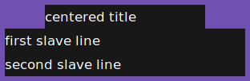
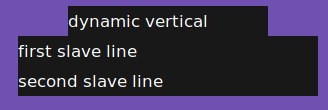
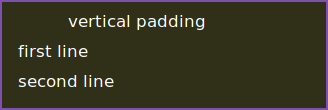
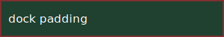

## Test: 01-uniform-inherited

### Args: -x 20 -y 20 -w 300 -h 30 -ta l -bg '#203040' -fg white -b 10

### Pipe data

```
uniform inherited
```

### Geometry: 10,10,320,50
### Title geometry: 20,20,300,30


## Test: 02-asymmetric-explicit

### Args: -x 40 -y 30 -w 300 -h 30 -ta l -bg '#101010' -fg white -b '4,8,12,16,#d03030'

### Pipe data

```
asymmetric explicit
```

### Geometry: 24,26,324,46
### Title geometry: 40,30,300,30


## Test: 03-implicit-full-width

### Args: -h 30 -ta l -bg '#182818' -fg white -b '5,10,#308050'

### Pipe data

```
implicit width fills the target
```

### Geometry: 0,0,1920,40
### Title geometry: 10,5,1900,30


## Test: 04-vertical-state

### Args: -x 100 -y 50 -l 2 -w 300 -tw 200 -h 30 -ta l -sa l -bg '#181818' -fg white -b '6,#7050b0' -e 'onstart=uncollapse,grabkeys;button1=collapse;button2=uncollapse;key_h=hide;key_u=unhide'

### Pipe data

```
centered title
first slave line
second slave line
```

### Geometry: 44,44,312,102
### Title geometry: 100,50,200,30
### Slave geometry: 50,80,300,60



### Mouse: 110,15
### Click: 1
### Geometry: 94,44,212,42


### Click: 2
### Press key: h
### Geometry: 44,74,312,72
### Title geometry: 100,50,200,30
### Slave geometry: 50,80,300,60
### Outer mapping: IsViewable
### Title mapping: IsUnMapped
### Slave mapping: IsViewable


### Press key: u
### Geometry: 44,44,312,102
### Title geometry: 100,50,200,30
### Slave geometry: 50,80,300,60


## Test: 05-horizontal-and-hide

### Args: -x 30 -y 40 -l 3 -m h -w 300 -h 30 -bg '#151515' -fg white -b '3,7,9,11,#b08020' -e 'onstart=grabkeys;key_h=hide;key_u=unhide'

### Pipe data

```
header
one
two
three
```

### Geometry: 19,37,318,42
### Slave geometry: 30,40,300,30


### Press key: h
### Geometry: 19,37,318,42
### Slave geometry: 30,40,300,30
### Outer mapping: IsUnMapped
### Title mapping: IsUnMapped
### Slave mapping: IsUnMapped

### Press key: u
### Geometry: 19,37,318,42
### Slave geometry: 30,40,300,30
### Outer mapping: IsViewable
### Title mapping: IsUnMapped
### Slave mapping: IsViewable


## Test: 05a-title-only-strict-hide

### Args: -x 30 -y 40 -w 300 -h 30 -bg '#151515' -fg white -b '3,7,9,11,#b08020' -e 'onstart=grabkeys;key_h=hide;key_u=unhide'

### Pipe data

```
title only
```

### Geometry: 19,37,318,42
### Title geometry: 30,40,300,30
### Outer mapping: IsViewable
### Title mapping: IsViewable

### Press key: h
### Geometry: 19,37,318,42
### Title geometry: 30,40,300,30
### Outer mapping: IsUnMapped
### Title mapping: IsUnMapped

### Press key: u
### Outer mapping: IsViewable
### Title mapping: IsViewable

## Test: 05b-collapsed-vertical-strict-hide

### Args: -x 30 -y 40 -l 2 -w 300 -h 30 -bg '#151515' -fg white -b '3,7,9,11,#b08020' -e 'onstart=grabkeys;key_h=hide;key_u=unhide'

### Pipe data

```
collapsed title
one
two
```

### Geometry: 19,37,318,42
### Title geometry: 30,40,300,30
### Slave geometry: 30,70,300,60
### Slave mapping: IsUnMapped

### Press key: h
### Geometry: 19,37,318,42
### Title geometry: 30,40,300,30
### Slave geometry: 30,70,300,60
### Outer mapping: IsUnMapped
### Title mapping: IsUnMapped
### Slave mapping: IsUnMapped

### Press key: u
### Outer mapping: IsViewable
### Title mapping: IsViewable
### Slave mapping: IsUnMapped

## Test: 06-inherited-normbg

### Args: -x 20 -y 20 -w 300 -h 30 -ta l -bg '#202040' -fg white -b 8

### Pipe data

```
before inherited update
```


### Pipe data

```
^normbg(#206030)
```


## Test: 07-explicit-normbg

### Args: -x 20 -y 20 -w 300 -h 30 -ta l -bg '#202040' -fg white -b '8,#804020'

### Pipe data

```
before explicit update
```


### Pipe data

```
^normbg(#206030)
```


## Test: 08-border-has-no-actions

### Args: -x 20 -y 20 -w 300 -h 30 -ta l -bg '#181818' -fg white -b '10,#305080'

### Pipe data

```
^ca(1,printf content-hit)clickable^ca()
```

### Mouse: 5,15
### Click: 1
### Check no output

### Mouse: 15,15
### Click and check output: 1, content-hit

## Test: 09-slave-above-title

### Args: -x 100 -y 1060 -l 2 -w 300 -h 30 -ta l -sa l -bg '#181818' -fg white -b '5,#406080' -e 'onstart=uncollapse'

### Pipe data

```
title below
slave above one
slave above two
```

### Geometry: 95,980,310,100
### Title geometry: 100,1045,300,30
### Slave geometry: 100,985,300,60


## Test: 10-dynamic-expand-static-border

### Args: -x 80 -y 40 -expand right -h 30 -ta l -bg '#181818' -fg white -b '7,#904060'

### Pipe data

```
expanded title
```


## Test: 11-dynamic-widths-and-disable

### Args: -x 20 -y 20 -w 300 -h 30 -ta l -bg '#203040' -fg white -b 0

### Pipe data

```
dynamic widths
```

### Pipe data

```
^border(10)
```

### Geometry: 10,10,320,50
### Title geometry: 20,20,300,30


### Pipe data

```
^border(4,8,12,16,#d03030)
```

### Geometry: 4,16,324,46
### Title geometry: 20,20,300,30


### Pipe data

```
^border(0)
```

### Geometry: 20,20,300,30
### Title geometry: 20,20,300,30


### Pipe data

```
^border(0)
```

### Geometry: 20,20,300,30

## Test: 12-dynamic-color-mode

### Args: -x 20 -y 20 -w 300 -h 30 -ta l -bg '#202040' -fg white -b 8

### Pipe data

```
dynamic color mode
```

### Pipe data

```
^border(8,#804020)
```


### Pipe data

```
^border(8)
```

### Pipe data

```
^normbg(#206030)
```


## Test: 13-dynamic-vertical-state

### Args: -x 100 -y 50 -l 2 -w 300 -tw 200 -h 30 -ta l -sa l -bg '#181818' -fg white -b 2 -e 'onstart=uncollapse;button1=collapse;button2=uncollapse'

### Pipe data

```
dynamic vertical
first slave line
second slave line
```

### Pipe data

```
^border(6,10,14,18,#7050b0)
```

### Geometry: 32,44,328,110
### Title geometry: 100,50,200,30
### Slave geometry: 50,80,300,60



### Mouse: 110,15
### Click: 1
### Geometry: 82,44,228,50
### Slave mapping: IsUnMapped

### Pipe data

```
^border(3)
```

### Geometry: 97,47,206,36
### Title geometry: 100,50,200,30
### Slave mapping: IsUnMapped


## Test: 14-dynamic-horizontal-hidden

### Args: -x 30 -y 40 -l 3 -m h -w 300 -h 30 -bg '#151515' -fg white -b 2 -e 'onstart=grabkeys;key_h=hide;key_u=unhide'

### Pipe data

```
header
one
two
three
```

### Press key: h
### Outer mapping: IsUnMapped
### Slave mapping: IsUnMapped

### Pipe data

```
^border(3,7,9,11,#b08020)
```

### Geometry: 19,37,318,42
### Slave geometry: 30,40,300,30
### Outer mapping: IsUnMapped
### Slave mapping: IsUnMapped

### Press key: u
### Outer mapping: IsViewable
### Slave mapping: IsViewable


## Test: 15-dynamic-invalid-unchanged

### Args: -x 20 -y 20 -w 300 -h 30 -ta l -bg '#181818' -fg white -b '5,#305080'

### Pipe data

```
invalid updates survive
```

### Pipe data

```
^border(1,2,3)
```

### Geometry: 15,15,310,40

### Pipe data

```
^border(5,definitely-not-an-x11-color)
```

### Geometry: 15,15,310,40

### Pipe data

```
^border(65535)
```

### Geometry: 15,15,310,40
### Dzen app is running?: yes


## Test: 16-dynamic-dock-strut

### Args: -dock -x 0 -y 0 -w 300 -h 30 -ta l -bg '#181818' -fg white -b 2

### Pipe data

```
dynamic dock strut
```

### Dock strut: 0,0,34,0,0,0,0,0,0,303,0,0

### Pipe data

```
^border(6,10,14,18,#7050b0)
```

### Geometry: 0,0,328,50
### Title geometry: 18,6,300,30
### Dock strut: 0,0,50,0,0,0,0,0,0,327,0,0

### Pipe data

```
^border(0)
```

### Geometry: 0,0,300,30
### Title geometry: 0,0,300,30
### Dock strut: 0,0,30,0,0,0,0,0,0,299,0,0

## Test: 17-static-padding-box-model

### Args: -x 40 -y 40 -w 240 -h 30 -ta l -bg '#203040' -fg white -b '4,#b03030' -pad 10

### Pipe data

```
^ca(1,printf padding-content-hit)uniform padding^ca()
```

### Geometry: 26,26,268,58
### Title geometry: 40,40,240,30


### Mouse: 8,20
### Click: 1
### Check no output

### Mouse: 20,20
### Click and check output: 1, padding-content-hit

## Test: 18-asymmetric-padding

### Args: -x 60 -y 60 -w 260 -h 30 -ta l -bg '#305020' -fg white -b '3,#3050b0' -pad '4,8,12,16'

### Pipe data

```
asymmetric padding
```

### Geometry: 41,53,290,52
### Title geometry: 60,60,260,30


## Test: 19-dynamic-padding-and-normbg

### Args: -x 50 -y 50 -w 240 -h 30 -ta l -bg '#202040' -fg white -b '5,#b03030' -pad 0

### Pipe data

```
dynamic padding
```

### Pipe data

```
^padding(8)
```

### Geometry: 37,37,266,56
### Title geometry: 50,50,240,30

### Pipe data

```
^normbg(#207040)
```


### Pipe data

```
^padding(3,9,11,5)
```

### Geometry: 40,42,264,54

### Pipe data

```
^padding(1,2,3)
```

### Geometry: 40,42,264,54

### Pipe data

```
^padding(4294967296)
```

### Geometry: 40,42,264,54

### Pipe data

```
^padding(0)
```

### Geometry: 45,45,250,40

## Test: 20-padding-vertical-hidden

### Args: -x 100 -y 80 -l 2 -w 300 -tw 200 -h 30 -ta l -sa l -bg '#303018' -fg white -b '2,#8050b0' -pad '4,8,12,16' -e 'onstart=uncollapse;button1=hide;button2=unhide'

### Pipe data

```
vertical padding
first line
second line
```

### Geometry: 32,74,328,110
### Title geometry: 100,80,200,30
### Slave geometry: 50,110,300,60



### Mouse: 100,50
### Click: 1
### Geometry: 32,104,328,80
### Title mapping: IsUnMapped
### Slave mapping: IsViewable


### Click: 2
### Geometry: 32,74,328,110

## Test: 21-padding-horizontal-hidden-and-escape

### Args: -x 80 -y 60 -l 3 -m h -w 300 -h 30 -bg '#183040' -fg white -b '3,#b08020' -pad 6 -e 'onstart=grabkeys;key_h=hide;key_u=unhide'

### Pipe data

```
header
one
two
three
```

### Geometry: 71,51,318,48
### Slave geometry: 80,60,300,30


### Press key: h
### Outer mapping: IsUnMapped
### Slave mapping: IsUnMapped

### Pipe data

```
^padding(broken)
```

### Geometry: 71,51,318,48
### Outer mapping: IsUnMapped

### Press key: u
### Outer mapping: IsViewable
### Slave mapping: IsViewable

## Test: 22-padding-dock-strut

### Args: -dock -x 0 -y 0 -w 300 -h 30 -ta l -bg '#204030' -fg white -b '2,#803030' -pad 10

### Pipe data

```
dock padding
```

### Geometry: 0,0,324,54
### Title geometry: 12,12,300,30
### Dock strut: 0,0,54,0,0,0,0,0,0,323,0,0



## Test: 23-escaped-padding-is-literal

### Args: -x 40 -y 40 -w 300 -h 30 -ta l -bg '#202020' -fg white

### Pipe data

```
^^padding(10)
```

### Geometry: 40,40,300,30


